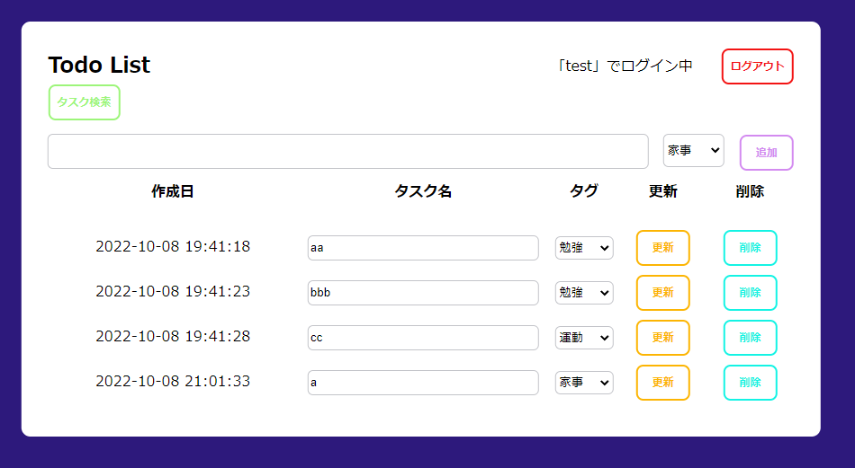
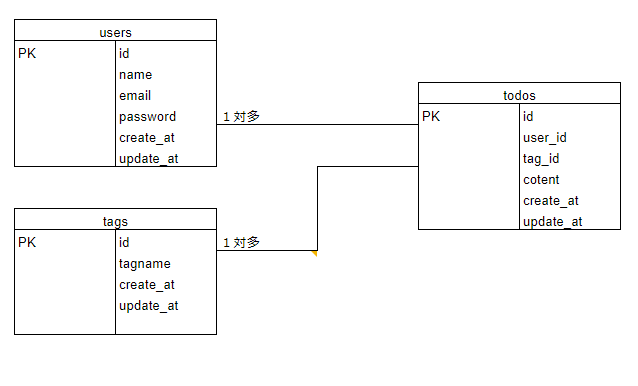

# アプリケーション名
Todo管理アプリ

  

## 作成した目的
日々のタスク管理

## 機能一覧
・ユーザーログイン
・ユーザー登録
・ユーザーログアウト

・Todo一覧表示

・Todo作成

・Todo更新

・Todo削除

・Todo検索

・タグ選択

## 使用技術（実行環境）
Laravel　8.83.24

## テーブル設計

テーブル名：
Todos
カラム：
id
user_id
tag_id
content
create_at
update_at

テーブル名：
users
カラム：
id
name
email
password
create_at
update_at

テーブル名：
tags
カラム：
id
tagname
create_at
update_at
	

## ER図

  

## 他に記載することがあれば記述する
